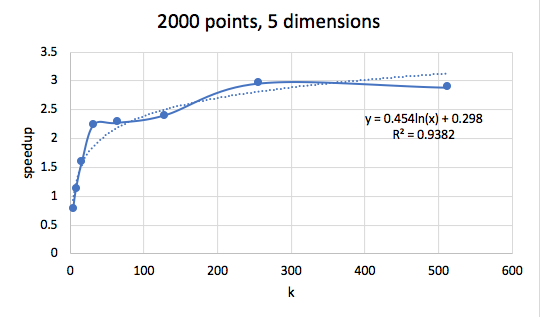
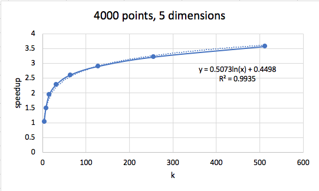

## Rust Kmeans
### A relatively idiomatic version of the K-means algorithm written in rust

This project contains a Kmeans runner with options to run in parallel or sequential.

main() reads from stdin. The first line is expected to contain 5 numbers, in the following oder: number of points, dimensions per point, number of clusters to place, maximum iterations, and finally a filler number which may eventually allow the naming of points. The next numbers will be used as the input points. The clusters are originally placed at the locations of a few randomly selected points from the dataset.

This project stores all points inside of one KmeansRunner struct, instead of moving them around to different clusters. Points are associated with a cluster by storing cluster id which corresponds to the index of the cluster in the KmeansRunner's array of clusters. On each iteration, each point finds its nearest cluster, and updates itself to point to said cluster. Next, The points are sorted by cluster, then split off into slices by cluster. Each cluster is then given a reference to the slice of points associated with it in order to compute its new center. This process is iterated over and over until max_iterations is hit or convergence is reached.

For parallelism, this project uses the rayon crate to transform its iterators into parallel iterators.

Performance on various sized inputs:

 

 

 
